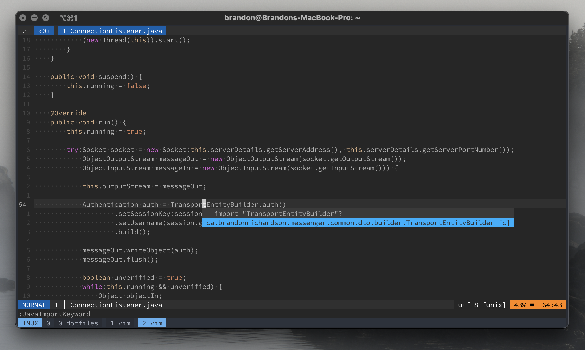

# java-support.vim

[](https://github.com/brandon1024/java-support.vim/blob/main/doc/java-support.txt)

A Vim plugin for easier editing of Java files. Rearrange, optimize, and
reformat import statements. Import classes easily with the help of tag files.



<sup>Note: Neovim is not yet supported, but contributions welcome!</sup>

## Installation
This plugin has no external dependencies, so you can easily install with your
favourite plugin manager.

With [vim-plug](https://github.com/junegunn/vim-plug):
```vim
Plug 'brandon1024/java-support.vim'
```

## Usage
To sort import statements in the current buffer:
```vim
:JavaSortImports
```

To import a class under the current keyword (or a specific class):
```vim
:JavaImportKeyword
:JavaImportKeyword MyClass
```

To index Java files from your project (cwd):
```vim
:JavaImportIndex
```

The class import functionality relies on the existence of a tags file. The tags
file can be generated with a tool like
[universal-ctags](https://github.com/universal-ctags/ctags). The ctags
generator must smart enough to read Java files correctly (including metadata
like whether it's a class or enum).

You can add a mapping to make your life a bit easier:
```vim
nnoremap <silent> <leader>jo :JavaSortImports<CR>
nnoremap <silent> <leader>ji :JavaImportKeyword<CR>
nnoremap <silent> <leader>jc :JavaImportIndex<CR>
```

## Configuration
See documentation for full configuration options.

## Contributing
Contributions are welcome! Remember to write some tests for your changes.

Some tests rely on the existence of a tag file. If you change sample Java files
in `test/input/`, you'll need to regenerate a tag file. To do this, install
[Universal Ctags](https://github.com/universal-ctags/ctags) and run (from the
project root):
```
$ ctags -o test/input/tags -R --tag-relative=yes test/input
```

## License
This project is licensed under the MIT license.

