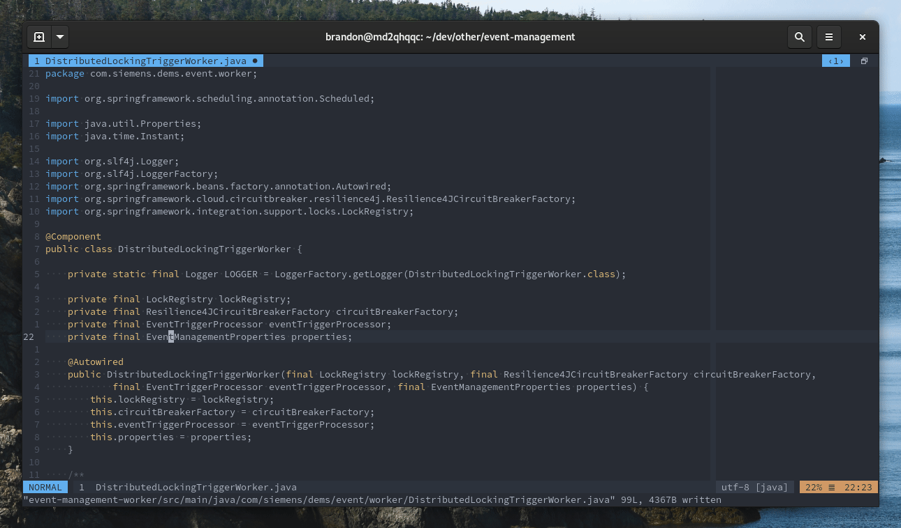

# cortado.vim ☕


[](https://github.com/brandon1024/cortado.vim/blob/main/doc/cortado.txt)

Work on your favourite Java projects in Vim! No complicated language server
setup required!

Import classes by name, reformat import statemens, and many other goodies!




<sup>Note: Neovim is not yet supported, but contributions welcome!</sup>

## Installation

This plugin has no external dependencies, so you can easily install with your
favourite plugin manager.

With [vim-plug](https://github.com/junegunn/vim-plug):

```vim
Plug 'brandon1024/cortado.vim'
```

## Usage

To cleanup import statements:

```vim
	:Cortado imports sort
```

To import a class or enum with a specific name:

```vim
	:Cortado imports add MyClass
```

To import a class or enum with a name under the cursor:

```vim
	:Cortado imports add
```

To re-index (cache) references from imports in the current project (cwd):

```vim
	:Cortado index
```

To insert a local variable declaration under the current line:

```vim
	:Cortado insert-var
```

This plugin uses tag files to locate classes and build fully-qualified class
names. Without it, import features will be limited. The tags file can be
generated with a tool like
[universal-ctags](https://github.com/universal-ctags/ctags). The ctags
generator must smart enough to read Java files correctly (including metadata
like whether it's a class or enum).

Key mappings are not created by default, but you can add them if you wish. Here
are some mappings that I use:

```vim
	nmap <silent> <buffer> <C-i>      <Plug>(cortado-imports:add)
	nmap <silent> <buffer> <F6>       <Plug>(cortado-imports:sort)
	nmap <silent> <buffer> <leader>jc <Plug>(cortado-index:dir)
	nnoremap <silent> <buffer> <F5>   :Cortado insert-var<CR>
	inoremap <silent> <buffer> <F5>   <C-o>:Cortado insert-var<CR>
```

The possibilities don't end there. If you are feeling bold, you could
sort imports on a BufWritePre event to clean up imports before saving, or
configure indexing to run automatically at startup (on VimEnter event).

## Configuration

See documentation for full configuration options.

## Contributing

Contributions are welcome! Remember to write some tests for your changes.

Some tests rely on the existence of a tag file. If you change sample Java files
in `test/input/`, you'll need to regenerate a tag file. To do this, install
[Universal Ctags](https://github.com/universal-ctags/ctags) and run (from the
project root):

```
$ ctags -o test/input/tags -R --tag-relative=yes test/input
```

## License

This project is licensed under the MIT license.

